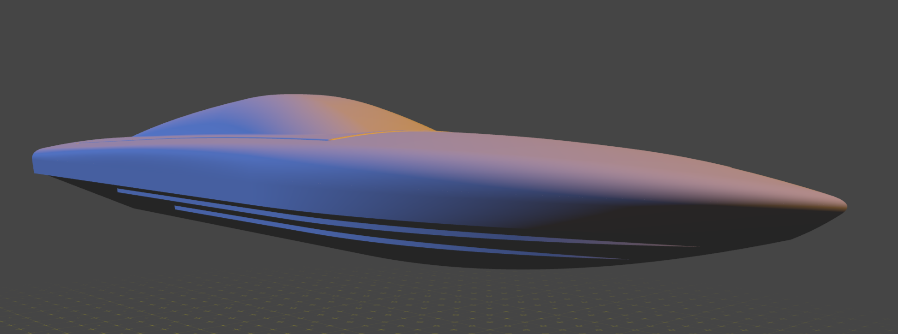
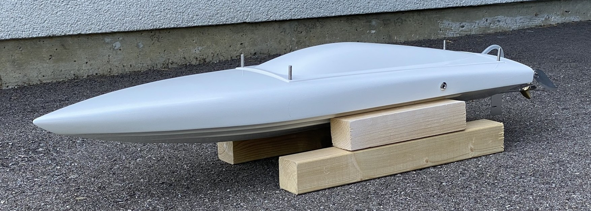
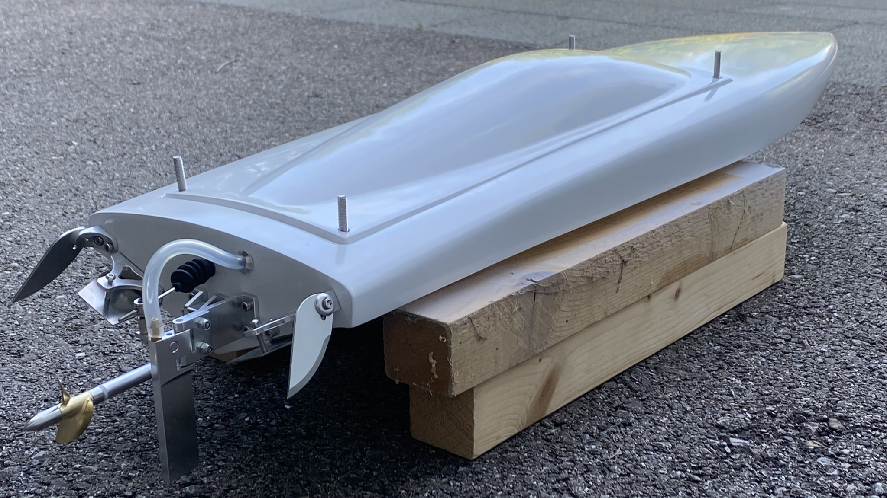
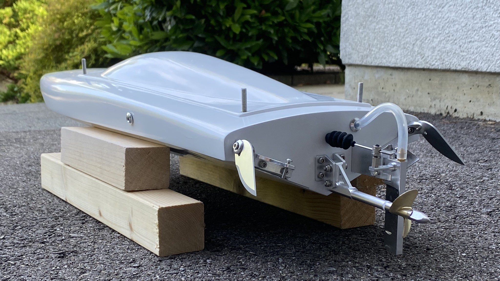
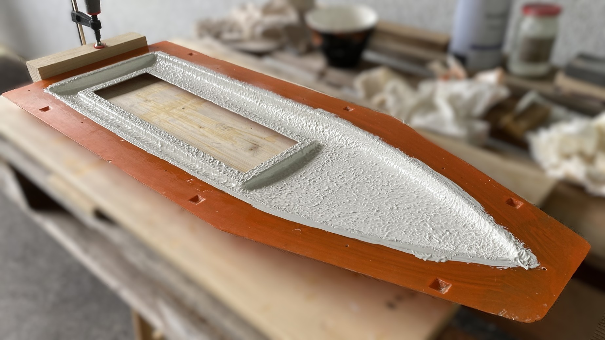
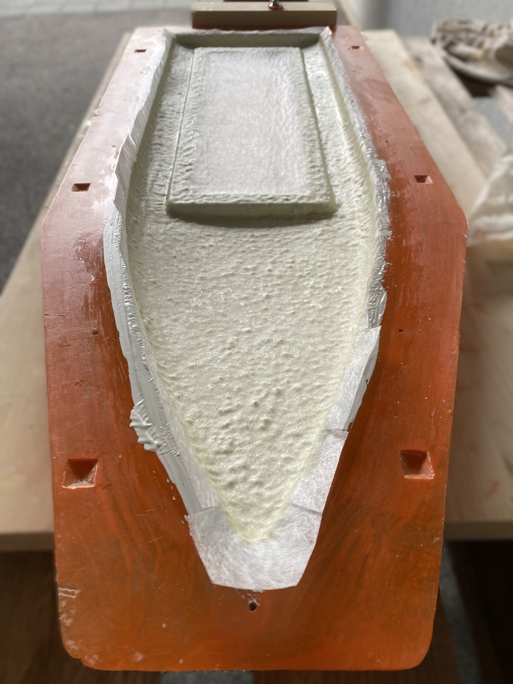
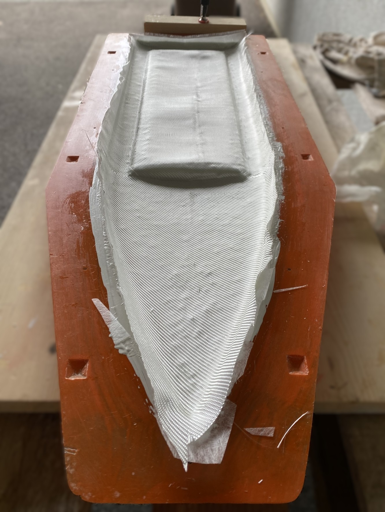
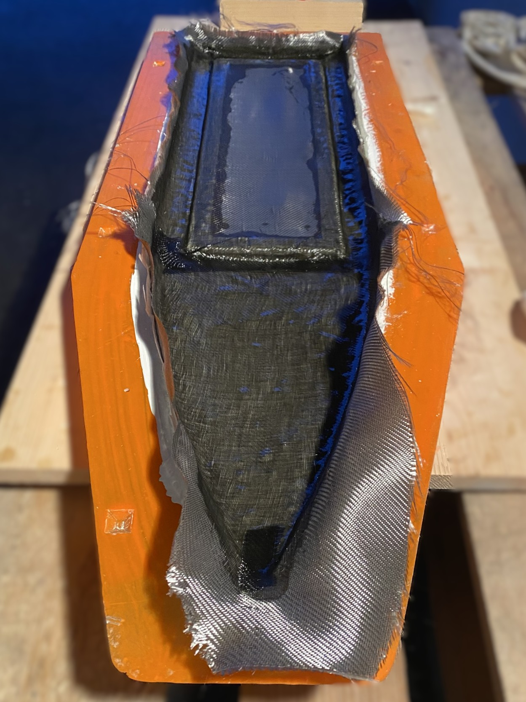
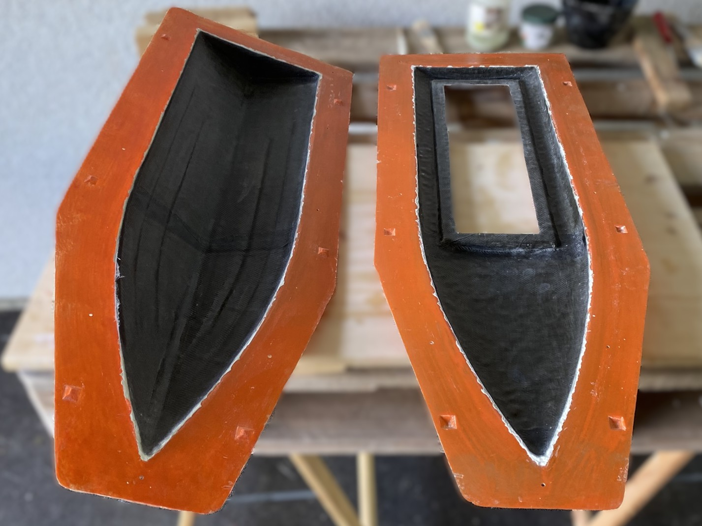
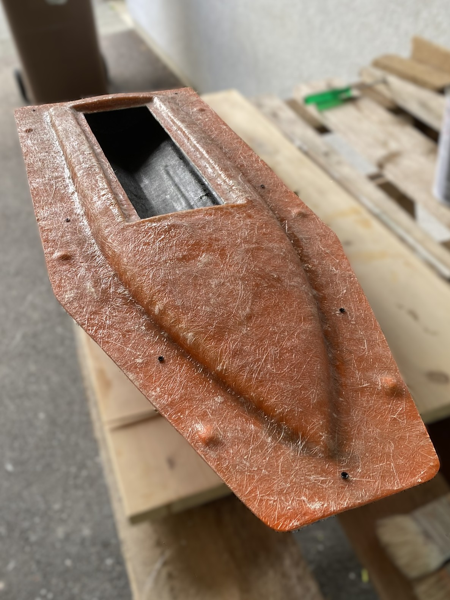

# RC Fiberglass Boat Project

## Author 
- Ricchieri Meven ( [GitHub Profile](https://github.com/Belprot), [Linkedin Profile](www.linkedin.com/in/meven-ricchieri-4b59b318b) )

## Introduction

This project documents the complete process of designing and building an RC fiberglass boat from scratch. It covers every stage, from creating the master plug and fabricating the mold to producing the final fiberglass hull with polyester resin. The goal was to gain hands-on experience with composite fabrication techniques and to understand each step involved in transforming a digital model into a fully functional RC boat. The vessel was named Theia, a luminous echo of the Titaness who gave birth to the Sun and the Moon.

## Current status overview

*3D model of the RC boat hull used as the basis for the project.*

*Current state of the project.*

The model is almost complete, at this stage, the design is entirely white with no additional colors or details applied yet.

Show more

--- 

## 3D model
This section provides an overview of the 3D model used as the foundation for the RC fiberglass boat project, including its origin, modifications, and preparation for fabrication.

Show details

The project began with a 3D hull model sourced online, with the primary objective being to learn and master the process of fiberglass lamination. Using an existing design enabled a focus on composite fabrication techniques rather than hull design.

The 3D model was scaled to approximately 755 mm in length to match the desired hull size. To accommodate the limitations of the available 3D printer, the hull was sliced into six separate sections. Each piece was printed individually and then carefully assembled to form the complete master plug for mold making.

> [!NOTE]  
> This page is a work in progress and will be updated with more details soon.

--- 

## Master plug 
This section outlines the creation of the master plug, which serves as the positive form for producing the fiberglass mold. It covers the preparation, assembly, and finishing steps required to ensure a smooth and accurate surface, essential for high-quality mold fabrication.

Show details

> [!NOTE]  
> This page is a work in progress and will be updated with more details soon.

---

## Mold
This section explains the process of creating the fiberglass mold from the master plug. It includes surface preparation, application of release agents, and the step-by-step lamination of fiberglass layers to produce a durable mold suitable for repeated hull fabrication.

Show details

> [!NOTE]  
> This page is a work in progress and will be updated with more details soon.

---

## Final fiberglass hull 
This section describes the process of creating the final fiberglass hull, including the preparation of the mold, application of fiberglass layers, and assembly of the upper and lower hull parts.

Show details

### Upper part of the hull
| Step  | Picture  |
|---|---|
After preparing the mold with 3 layers of release wax and a layer of polyvinyl alcohol, I applied the gelcoat layer. |   |
I then applied a 30 g/m² fiberglass veil using polyester resin. |  |
| I then applied a 150 g/m² fiberglass rover using polyester resin. |  |
| I then applied a 150 g/m² black fiberglass rover using polyester resin. |  |

### Lower part of the hull
The same steps were performed.

### Mold closing and assembly
Once the upper and lower parts had cured, the excess fiberglass fabric protruding from the mold was trimmed to allow proper assembly of the two sections.

The interior joint was then made using strips of fiberglass fabric. 

---

## Power and conrol
This section covers the selection and installation of the power and control systems for the RC fiberglass boat. It outlines the main electronic components required for propulsion and steering, and provides an overview of how these systems are integrated to enable remote operation of the vessel.

Show details

### Components

- **Transmitter & Receiver:** ...
- **Electronic Speed Controller (ESC):** ...
- **Motor:** ...
- **Battery:** ...
- **Servo:** ...

> [!NOTE]
> This section is a work in progress and will be updated with more technical details and photos.

---
