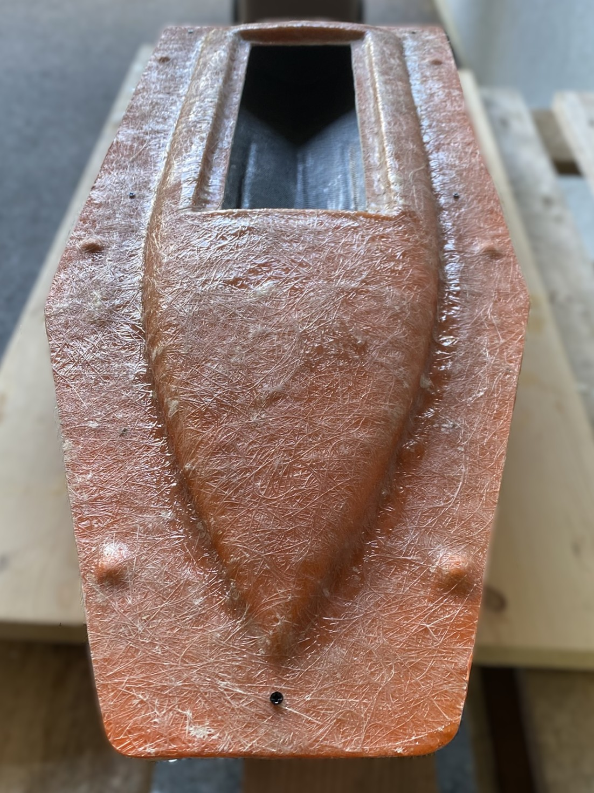

# RC Fiberglass Boat Project

## Author
- Ricchieri Meven ( [GitHub Profile](https://github.com/Belprot), [Linkedin Profile](www.linkedin.com/in/meven-ricchieri-4b59b318b) )

## Introduction

This project documents the complete process of designing and building an RC fiberglass boat from scratch. It covers every stage, from creating the master plug and fabricating the mold to producing the final fiberglass hull with polyester resin. The goal was to gain hands-on experience with composite fabrication techniques and to understand each step involved in transforming a digital model into a fully functional RC boat. The vessel was named Theia, a luminous echo of the Titaness who gave birth to the Sun and the Moon.

## 3D model

I began with a 3D hull model I found online, as my initial goal was to learn and master the process of fiberglass lamination. Starting from an existing design allowed me to focus on the composite fabrication techniques rather than hull design.

I scaled the 3D model to approximately 755 mm in length to match my desired hull size. To accommodate the limitations of my 3D printer, I sliced the hull into six separate sections. Each piece was printed individually and then carefully assembled to form the complete master plug for mold making.

## Current state

The model is almost complete, at this stage, the design is entirely white with no additional colors or details applied yet.

## Master plug 
> [!NOTE]
> This page is a work in progress and will be updated with more details soon.

## Mold
> [!NOTE]
> This page is a work in progress and will be updated with more details soon.

## Final fiberglass hull 

### Upper part of the hull
| Step  | Picture  |
|---|---|
After preparing the mold with 3 layers of release wax and a layer of polyvinyl alcohol, I applied the gelcoat layer. |   |
I then applied a 30 g/m² fiberglass veil using polyester resin. |  |
| I then applied a 150 g/m² fiberglass rover using polyester resin. |  |
| I then applied a 150 g/m² black fiberglass rover using polyester resin. |  |
---

### Lower part of the hull
The same steps were performed.

### Mold closing and assembly

Once the upper and lower parts had cured, the excess fiberglass fabric protruding from the mold was trimmed to allow proper assembly of the two sections.

The interior joint was then made using strips of fiberglass fabric. 

## Materials
> [!NOTE]
> This page is a work in progress and will be updated with more details soon.

## Links
> [!NOTE]
> This page is a work in progress and will be updated with more details soon.

https://www.swiss-composite.ch/fr/

## XXXXXX
> [!NOTE]
> This page is a work in progress and will be updated with more details soon.

---

